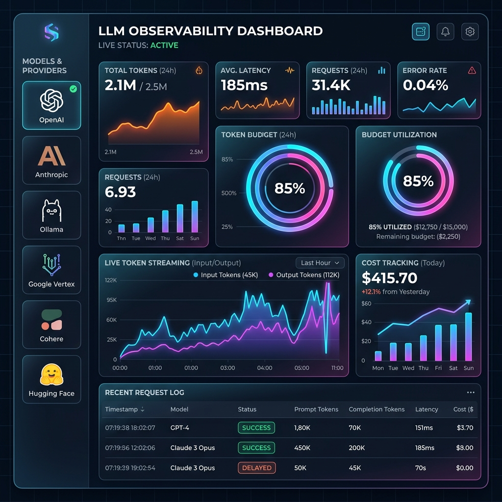

# Otellix

**Stop the LLM Bill Shock. Production-grade observability for Go backends — built on OpenTelemetry.**



[](https://github.com/oluwajubelo1/otellix/actions/workflows/ci.yml)
[](https://pkg.go.dev/github.com/oluwajubelo1/otellix)
[](https://goreportcard.com/report/github.com/oluwajubelo1/otellix)
[](https://opensource.org/licenses/MIT)

---

### 💸 The Problem: "Bill Shock" is Real
Most LLM observability tools tell you what you spent *after* the money is gone. In production, a recursive prompt loop or a single "power user" can rack up thousands in costs before your billing alerts even trigger. 

**Otellix is different.** It brings real-time cost enforcement to the application layer.

---

## ⚡ Key Features

- **⛓️ LangChainGo Integration**: Drop-in `callbacks.Handler` for LangChainGo. Zero-config cost tracking for complex chains.
- **🔌 Zero-Config Attribution**: Automatically capture `user_id` and `project_id` from Gin/Echo middleware. No more manual context plumbing.
- **🗄️ Redis Budget Store**: Distributed budget enforcement for high-availability production clusters.
- **🚀 Go-Native & High-Performance**: Built for Go 1.22+ using native streaming and OpenTelemetry. 
- **📊 Standard-Compliant (OTel)**: 100% OTel compliant. Works with Jaeger, Honeycomb, Prometheus, and Grafana.
- **💎 Prompt Caching ROI**: Track exactly how much you save with Anthropic/OpenAI prompt caching.

---

## 🚀 Quick Start

```bash
go get github.com/oluwajubelo1/otellix
```

### 1. Simple Tracing
Wrap your provider calls to get instant cost attribution and standard OTel spans.

```go
p := openai.New()
result, err := otellix.Trace(ctx, p, params,
    otellix.WithUserID("user_456"),
)
```

### 2. LangChainGo Integration
Just add the Otellix handler to your LLM configuration.

```go
import "github.com/oluwajubelo1/otellix/integrations/langchaingo"

handler := langchaingo.NewOtellixHandler()
p, _ := openai.New(openai.WithCallback(handler))

// Automatically captures all chain events, costs, and spans.
res, err := p.GenerateContent(ctx, parts)
```

### 3. Middleware Attribution
Stop manually passing IDs. Use our middleware to discover identity from headers/sessions.

```go
r := gin.Default()
r.Use(otellixgin.Middleware()) // Automatically populates context with User/Project IDs
```

---

## 📊 Standardized OTel Attributes
Otellix populates your spans with industry-standard attributes:

| Attribute | Description |
|---|---|
| `llm.provider` | The LLM provider (OpenAI, Anthropic, etc.) |
| `llm.usage.cache_read_tokens` | Tokens served from provider cache (Savings!) |
| `llm.cost_usd` | Real-time USD cost of the call |
| `llm.budget.blocked` | Flag if the call was blocked by guardrails |

---

## 🏗️ Supported Providers

- **Anthropic**: Claude 3.5 with full **Prompt Caching** metrics.
- **OpenAI**: GPT-4o, GPT-4o-mini with caching support.
- **Google Gemini**: Gemini 1.5 Pro & Flash.
- **Ollama**: Local models with zero-dependency streaming.

---

## 📖 Deep Dives
*   [**Architecture**](docs/architecture.md) — How Otellix fits into the OTel ecosystem.
*   [**Budget Guardrails**](docs/budget-guardrails.md) — Redis & InMemory stores.
*   [**Integrations**](docs/integrations.md) — LangChainGo setup.
*   [**Middleware & Identity**](docs/middleware.md) — Zero-config attribution.
*   [**Prompt Caching**](docs/caching.md) — ROI analysis and tracking.

---

## 🤝 Contributing
We love stars and contributions! Please see [CONTRIBUTING.md](CONTRIBUTING.md).
Licensed under **MIT**.
