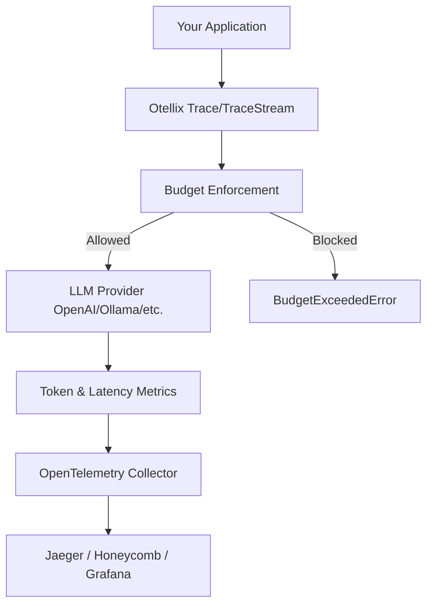

# Architecture Overview

Otellix is a Go-native wrapper designed to bring professional observability, cost tracking, and budget safety to LLM-powered applications. It acts as a standardized interface between your application logic and multiple LLM providers.

## High-Level Flow

## Core Components

### 1. Tracing Wrapper (`otellix.Trace`)
The primary entry point. It wraps your LLM calls in an OpenTelemetry span and automatically populates attributes like `llm.input_tokens`, `llm.cost_usd`, and `llm.prompt_fingerprint`.

### 2. Streaming Wrapper (`otellix.TraceStream`)
A specialized wrapper for real-time interactions. It uses Go 1.23 iterators to yield tokens as they arrive while tracking cumulative usage and enforcing budget limits mid-flight.

### 3. Provider Interface (`providers.Provider`)
A unified interface that abstracts the differences between SDKs (e.g., `openai-go` vs. `google-genai`). This ensures that your application logic remains decoupled from specific provider implementations.

### 4. Budget System (`otellix.BudgetConfig`)
A policy-driven enforcement layer. It checks current spend against predefined limits (per-user or per-project) before and during LLM execution.

## Data Standardisation

Otellix maps all provider-specific terminology into a single, standardized set of OTel attributes:

| Attribute | Source | Standardized Mapping |
| --- | --- | --- |
| Input Tokens | `prompt_tokens`, `input_token_count` | `llm.input_tokens` |
| Output Tokens | `completion_tokens`, `candidates_token_count` | `llm.output_tokens` |
| USD Cost | Internal Pricing Map | `llm.cost_usd` |
| Latency | Wall-clock time | `llm.latency_ms` |

## Observability Stack

Otellix is designed to be **backend-agnostic**. As long as you have an OpenTelemetry collector or exporter configured (e.g., OTLP), Otellix will ship metrics and traces to your preferred dashboard.
